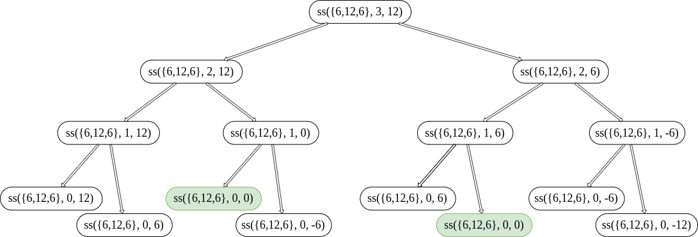
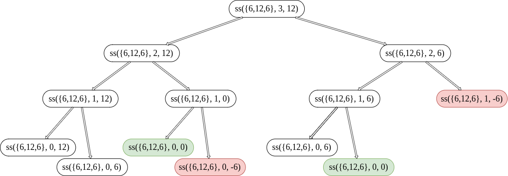
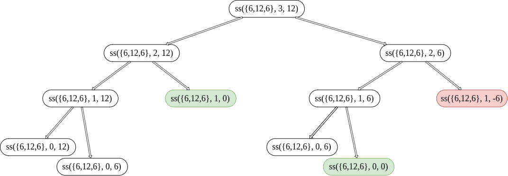
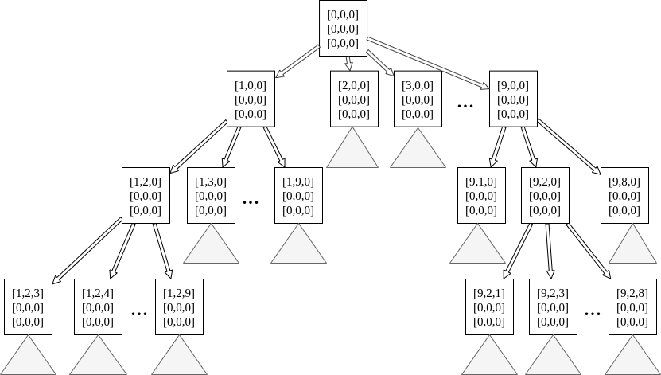
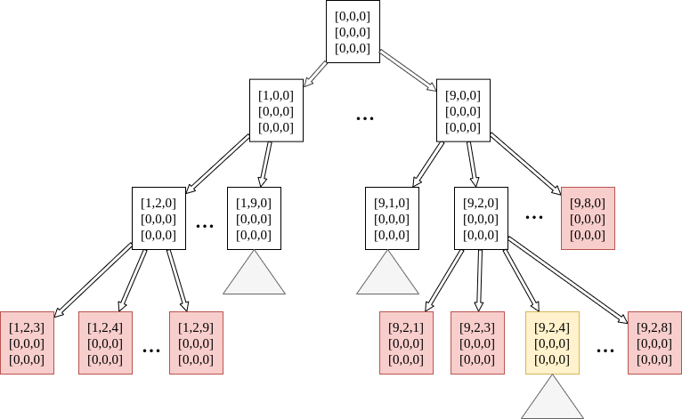
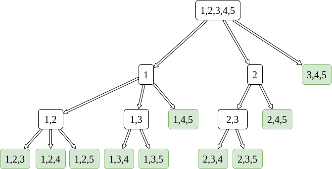

# Guía práctica 1: ejercicios de BackTracking

## Ejercicio 1

### Ítem A

Las soluciones _candidatas_ son $(0,0,0), (0,0,1), (0,1,0), (0,1,1), (1,0,0), (1,0,1), (1,1,0)$ y $(1,1,1)$

### Ítem B

Las soluciones _válidas_ son $(0,1,0)$ y  $(1,0,1)$

### Ítem C

Las soluciones _parciales_ son los subconjuntos del conjunto de partes de $(6,12,6)$

### Ítem D

El árbol de desiciones con _backtracking_ quedaría así:


Los nodos verdes serían las soluciones válidas. Los nodos rojos serían los inválidos, de los que no habría que continuar desarrollando las desiciones

### Ítem F

La **complejidad temporal** viene dada por: $cantidad\ hojas \times O(c/nodo) \Rightarrow O(2^n)$  

La **complejidad espacial** viene dada por: $O(mantener\ rama\ recursiva) \Rightarrow O(n)$  

### Ítem G

Árbol de desiciones del algoritmo propuesto en ítem $f)$




### Ítem H

Árbol de desiciones del algoritmo propuesto con la _regla de factibilidad_



### Ítem I

Podemos añadir la condición
```
    Si j == 0, retornar True
```

Cuando $j=0$, entonces en esa ramificación del árbol habrá una solución válida (o el mismo nodo será la solución). El árbol entonces quedaría:



El algoritmo implementado en `Rust` que cuenta la cantidad de soluciones queda:

```rust
pub fn subset_sum(nums: Vec<i32>, k: i32) -> i32 {
    fn subset_sum_helper(nums: &Vec<i32>, i: usize, k: i32) -> i32 {

        if k == 0 { 1 } // con este caso recorto mas el arbol

        else if i == 0 {
            if k == nums[i] { 1 }
            else { 0 }
        }
        else{
            subset_sum_helper(nums, i-1, k) +
                subset_sum_helper(nums, i-1, k-nums[i])
        }
    }
    subset_sum_helper(&nums, nums.len()-1, k)
}
```
Esto **sólo es válido porque el multiconjuntos es de Naturales**, ya que, quizá cortamos el algoritmo cuando nuestro $k$ llegó a $0$, por lo que nó habría más naturales para restarle. En cambio si estuviera como elemento el $0$, también formaría parte del subconjunto, y habrían más posibilidades.

### Ítem J

Me da fiaca hacer este, pero bastaría con una modificación en el algoritmo previo, teniendo un vector mutable en el argumento al que voy agregando las soluciones.

## Ejercicio 2

### Ítem A

Habría que generar $(n^2)!$ cuadrados mágicos si usáramos un algoritmo de _brute force_.

### Ítem B

El árbol recursivo quedaría de la forma:



Un algoritmo sería ir poniendo los números que corresponden; podemos tener un conjunto de $1...n$ en el que vamos quitando los elementos que ya pusimos, así nos ahorramos tener elementos repetidos y chequear en cada nodo no hoja que se cumpla esto. Luego, cuando este conjunto esté vacío, quiere decir que ya pusimos todos los números posibles, que ya llenamos el cuadrado y estamos en un nodo hoja; en ese caso, corroboraremos si el cuadrado cumple su propiedad de ser mágico. La complejidad temporal será de $O((n^2)! \times n^2)$  

El algoritmo en `Rust` para hallar los cuadrados mágicos de orden $n$ queda:

```rust
// busco cuadrados magicos con brute force
pub fn magic_squares(n: u8){

    fn find_all_squares(square: Vec<Vec<u8>>, nums: Vec<u8>, pos: (usize, usize)) -> Vec<Vec<Vec<u8>>> {

        if nums.is_empty() {
            let mut result: Vec<Vec<Vec<u8>>> = Vec::new();
            result.push(square.clone());
            result

        } else {
            let mut results: Vec<Vec<Vec<u8>>> = Vec::new();
            for i in 0..nums.len() {
                let mut new_square = square.clone();
                new_square[pos.0][pos.1] = nums[i]; // square with new num

                let mut new_nums = nums.clone();
                new_nums.remove(i); // erase inserted num

                let new_pos = // new position to do recursion
                    if pos.1 == square.len() - 1 {
                    (pos.0 + 1, 0) } else { (pos.0, pos.1 + 1)
                };
                results.extend(find_all_squares( // recursion
                    new_square,
                    new_nums,
                    new_pos,
                ));
            }
            results
        }
    }       // lo que sigue es solo para printear en pantalla las soluciones

    let initial_square = vec![vec![0; n as usize]; n as usize];
    let initial_nums = (1..=n*n).collect::<Vec<u8>>();
    let result = find_all_squares(initial_square, initial_nums, (0, 0));

    for sq in result{
        if is_magic(&sq) { println!("{:?}", sq) }
    }
}
```

Un test:

```rust
fn main() {
    ejercicios::magic_squares(3);
}
```

Output:
```
[[2, 7, 6], [9, 5, 1], [4, 3, 8]]
[[2, 9, 4], [7, 5, 3], [6, 1, 8]]
[[4, 3, 8], [9, 5, 1], [2, 7, 6]]
[[4, 9, 2], [3, 5, 7], [8, 1, 6]]
[[6, 1, 8], [7, 5, 3], [2, 9, 4]]
[[6, 7, 2], [1, 5, 9], [8, 3, 4]]
[[8, 1, 6], [3, 5, 7], [4, 9, 2]]
[[8, 3, 4], [1, 5, 9], [6, 7, 2]]
```

## Ítem E

El árbol recursivo quedaría entonces de la siguiente forma:  

  

Lo que hará entonces mi nueva solución es, cada vez que haya una línea completa en el cuadrado (sea row, column o diagonal) entonces chequeará que su suma sea igual al número mágico.  

Para le nuevo algoritmo, paso un vector con las soluciones por referencia mutable, para que decida el algoritmo si añadir o no la solución (a diferencia de antes, que al ser fuerza bruta toda rama de desiciones era una solución). En este caso la función no tiene ningun tipo de retorno. El código quedaría:

```rust
pub fn magic_squares_bt(n: u8){

    let magic_num = (n*n*n + n)/2;

    fn find_magic_squares(result: &mut Vec<Vec<Vec<u8>>>, square: Vec<Vec<u8>>, nums: Vec<u8>, pos: (usize, usize), magic_num: &u8) {

        // #############################################################################################
        if ! ejercicios_help::check_full_lines(&square, &magic_num){ // NUEVA REGLA DE FACTIBILIDAD !!!!
            return;                                                  
        } // ###########################################################################################

        if nums.is_empty() {
            result.push(square.clone());
            return;

        } else {
            for i in 0..nums.len() {
                let mut new_square = square.clone();
                new_square[pos.0][pos.1] = nums[i]; // square with new num

                let mut new_nums = nums.clone();
                new_nums.remove(i); // erase inserted num

                let new_pos = // new position to do recursion
                    if pos.1 == square.len() - 1 {
                        (pos.0 + 1, 0) } else { (pos.0, pos.1 + 1)
                    };
                find_magic_squares( // recursion
                                    result,
                                    new_square,
                                    new_nums,
                                    new_pos,
                                    magic_num);
            }
        }
    }       // lo que sigue es solo para printear en pantalla las soluciones

    let mut result: Vec<Vec<Vec<u8>>> = vec![];
    let initial_square = vec![vec![0; n as usize]; n as usize];
    let initial_nums = (1..=n*n).collect::<Vec<u8>>();
    find_magic_squares(&mut result, initial_square, initial_nums, (0, 0), &magic_num);

    for sq in result {
        println!("{:?}", sq)
    }
}
```

*Aclaraciones: intenté hacer algo distinto, como un algoritmo que cuando ya se pasara con los primeros numeros (por ejemplo, que la primera linea fuera [9,8,0] y todo el resto tuviera 0s) ya cortara la rama recursiva, pero estuve horas intentando hacer algo que al final estaba mal, así que me terminó dando fiaca e implemente algo más simple. Por último, hay una forma de hacerlo sin utilizar el conjunto de lso números restantes por ubicar, pero no sería con el invariante que propone el ejercicio por lo que fue la solución más factible que se me ocurrió.*  

## Ejercicio 3


Una forma de resolverlo sería buscar todos los subconjuntos de $k$ elementos en el conjunto de naturales $(1...n)$, cuya cantidad coincidirá con el número combinatorio $nCk$. Habría que buscarlos de manera exhaustiva y tener una variable constantemente que nos diga cuál es la máxima suma total posible. El árbol de desiciones de búsqueda de subconjuntos quedaría así: ejemplo con $k=$ y $n=5$  



Luego de obtener cada subconjunto, solo quedaría ver qué suma maximiza y chequear si es una nueva solución. Hice el algoritmo directamente con la mejor poda que se me ocurrió, que es lo que se ve en el árbol. La solución en código es la siguiente:

```rust
pub fn index_subset_max(matrix: & Vec<Vec<usize>>, k: usize){

    let mut n_set: Vec<usize> = vec![];
    for i in 0..matrix.len(){ n_set.push(i); } // aca inicializo todo lo necesario para la recursión
    let indexes: Vec<usize> = vec![];
    let mut solution: Vec<usize> = vec![];
    let mut sum: usize = 0;

    fn index_subset_max_helper(matrix: & Vec<Vec<usize>>,
                               indexes: & Vec<usize>,
                               current_solution: &mut Vec<usize>,
                               max_sum: &mut usize,
                               k: usize,
                               index: usize,
                               n_set: &Vec<usize>)
    {
        if k == 0 {
            println!("Formando subconjunto {:?}", indexes); // print test subset
            let new_sum = ejercicios_help::sum_up_all(matrix, indexes);
            if new_sum > *max_sum {
                *current_solution = indexes.clone();
                *max_sum = new_sum;
            }
        }
        else {
            // este ciclo restringe mucho la recursion para evitar conjuntos que no llevan a nada gracias al 1...(n - k)
            for i in index..=n_set.len() - k  { // si sacamos el -k funcionará igual, pero se harán más operaciones
                let mut new_solution = indexes.clone();
                new_solution.push(i);
                println!("Formando subconjunto {:?}", indexes); // test
                index_subset_max_helper(& matrix,
                                        &mut new_solution,
                                        current_solution,
                                        max_sum,
                                        k - 1,
                                        i+1,
                                        & n_set);
            }
        }
    }

    index_subset_max_helper(matrix, &indexes, &mut solution, &mut sum, k, 0, & n_set);

    println!("La solución es {:?} que maximiza la suma {}", solution, sum)
}
```

Acá el test de la guía:

```rust
let m: Vec<Vec<usize>> = vec![
                                vec![0,10,10,1],
                                vec![0,0,5,2],
                                vec![0,0,0,1],
                                vec![0,0,0,0]];

    index_subset_max(&m, 3);
```

Output:
```
Formando subconjunto []
Formando subconjunto [0]
Formando subconjunto [0, 1]
Formando subconjunto [0, 1, 2]
Formando subconjunto [0, 1]
Formando subconjunto [0, 1, 3]
Formando subconjunto [0]
Formando subconjunto [0, 2]
Formando subconjunto [0, 2, 3]
Formando subconjunto []
Formando subconjunto [1]
Formando subconjunto [1, 2]
Formando subconjunto [1, 2, 3]
La solución es [0, 1, 2] que maximiza la suma 25
```

La guía indexa a partir de 1 en vez de 0, por eso varían los números, pero es lo mismo. Le agregué un print para ver cómo se va formando el subconjunto y apreciar cómo el algoritmo no crea subconjuntos que no terminan en ninguna solución, como $[2,3]$, al que no se le podría agregar ningun otro elemento.  

## Ejercicio 4

Me dio fiaca pero creo que hay que usar un algoritmo muy similar al anterior, solo que en vez de calcular la suma, hay que calcular la función esa rara que pide la consigna.